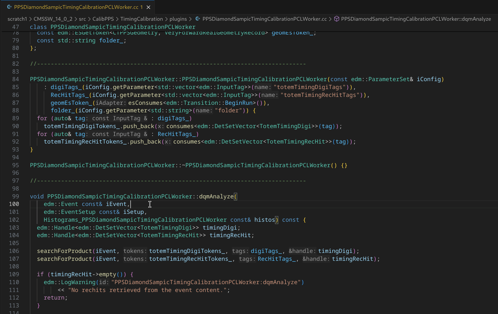
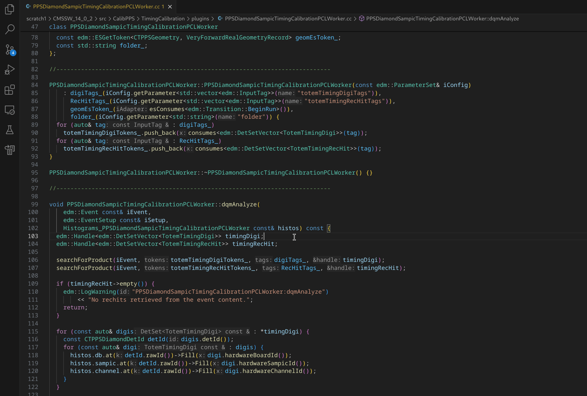
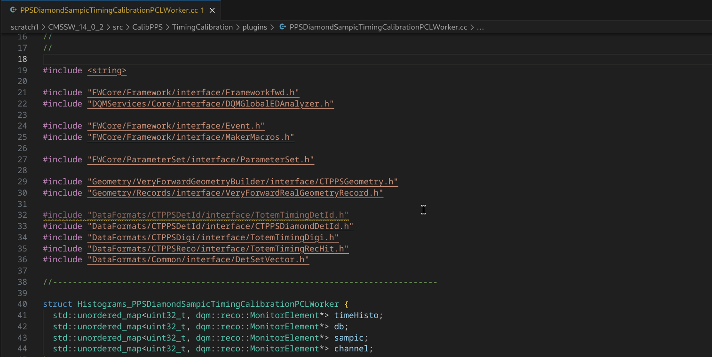
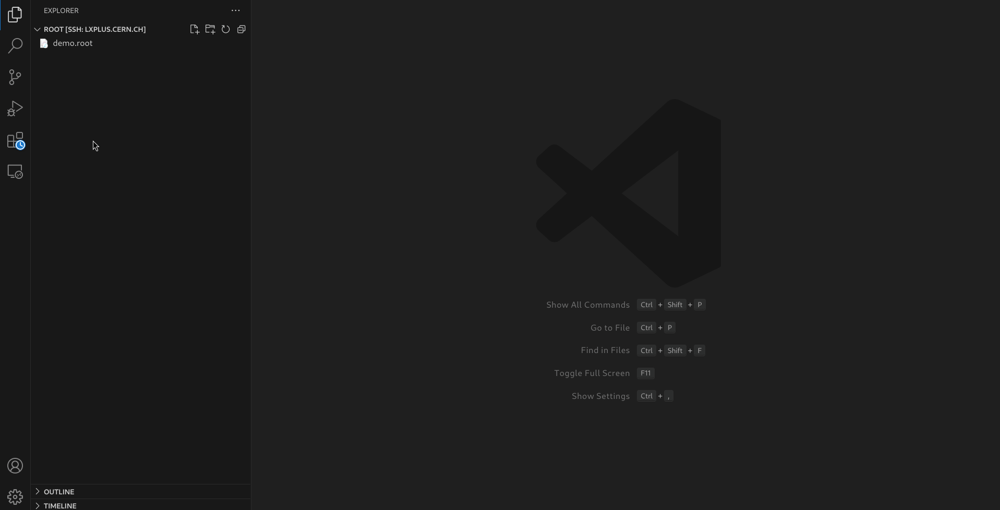

# cmssw_vscode
Recipies to develop CMSSW using VSCode

## Indexing files
Indexing files allows VSCode to easily resolve references to imported files. This provides:
- go to definition

    

- find references

    

- errors and warnings detection

    

More details and features in the [VSCode](https://code.visualstudio.com/docs/editor/editingevolved#_go-to-definition) and [clangd](https://clangd.llvm.org/features) documentations.

### C++
Indexing C++ files is based on the *clangd* extension alongside a *compile-commands.json* file.
1. Install clangd.
    1. In VSCode in the side bar go to *Extensions*.
    2. In the search bar type **clangd**.
    3. Click *Install*.
    4. Click *Install in SSH: lxplus.cern.ch*.
    5. Disable IntelliSense if you have to installed (comes with the C/C++ Microsoft extension).
        1. In VSCode press Ctrl + Shift + P, type **Preferences: Open Settings (UI)** and click Enter.
        2. Switch to *Remote [SSH: lxplus.cern.ch]*.
        3. In the search bar type **C_Cpp.intelliSenseEngine**.
        4. Switch to *disabled*.
2. Initialize your CMSSW release environment: execute `cmsenv` in the *src* subdirectory of your CMSSW repo. This will add two additional environment variables:
    - `CMSSW_RELEASE_BASE`: path to the CMSSW repo on the CVMFS shared network file system.
    - `CMSSW_BASE`: path to your locally cloned CMSSW repo.
3. Point clangd to the *compile_commands.json* file. VSCode will look for it on the `CMSSW_BASE` path, regardless which subdirectory you open. A couple of options exist:
    - Add the directory with the file to the clangd settings:
        1. In your terminal with the environment set up get the value of `CMSSW_RELEASE_BASE`:
            ```
            [tostafin@lxplus960 src]$ echo $CMSSW_RELEASE_BASE
            /cvmfs/cms.cern.ch/el9_amd64_gcc12/cms/cmssw/CMSSW_14_0_6
            ```
        2. In VSCode press Ctrl + Shift + P, type **Preferences: Open Settings (UI)** and click Enter.
        3. Switch to *Remote [SSH: lxplus.cern.ch]*.
        4. In the search bar type **clangd.arguments**.
        5. Add a new argument: `--compile-commands-dir=<value-of-CMSSW_RELEASE_BASE>`. For instance using the value above: `--compile-commands-dir=/cvmfs/cms.cern.ch/el9_amd64_gcc12/cms/cmssw/CMSSW_14_0_6`.
    - Create a symbolic link to the file: in your terminal with the environment set up execute `ln -s $CMSSW_RELEASE_BASE/compile_commands.json $CMSSW_BASE`.
    - Copy the file: in your terminal with the environment set up execute `cp $CMSSW_RELEASE_BASE/compile_commands.json $CMSSW_BASE`.
4. Restart the clangd server. Press Ctrl + Shift + P, type **clangd: Restart language server** and click Enter.

## ROOT files
ROOT is a data analysis framework used for visualizing large amounts of data using histograms, scatter plots etc.

### ROOT File Viewer
These graphics can be viewed in VSCode using the *ROOT File Viewer* extension.

1. Install ROOT File Viewer
    1. In VSCode in the side bar go to *Extensions*.
    2. In the search bar type **ROOT File Viewer**.
    3. Click *Install*.
2. Open a ROOT file by left-clicking on it in the *Explorer* tab.
3. Select a graphic to display.

---

# Fix VSCode SSH Connection Errors with AFS

If you connect to a remote machine using **AFS (Andrew File System)**, you might encounter a recurring bug that forces you to delete the `.vscode-server` folder from the remote every time you want to reconnect.

## The Fix

1. **Create a dedicated folder for VSCode server files in your EOS home directory.**

   Suppose your username is `jkowal`, run the following command on the remote machine:

   ```bash
   mkdir -p /eos/user/j/jkowal/vscode-server
   ```

2. **Remove the existing `.vscode-server` from your AFS home directory.**
    ```bash
   rm -r ~/.vscode-server
   ```
3. **Create a symbolic link pointing from your AFS home directory to the new folder.**
    ```bash
    ln -s /eos/user/j/jkowal/vscode-server ~/.vscode-server
    ```
